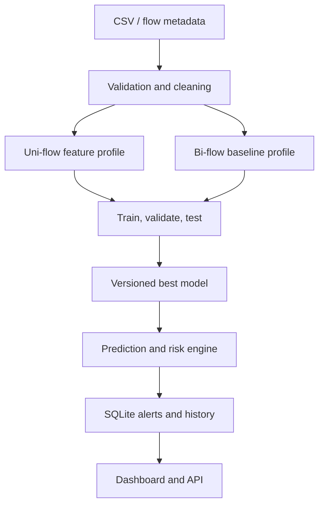

# ThreatGuard UniFlow AI

**Final-year project:** AI-Based Detection of Cyber Threats in Unidirectional IP Traffic

ThreatGuard is a working defensive cybersecurity research platform. It validates labeled flow datasets, removes reverse-direction fields for the main uni-flow experiment, trains and compares machine-learning models, calibrates an attack threshold on validation data, classifies new flows, generates risk-rated alerts, stores evidence in SQLite, and presents the results in a Streamlit dashboard and authenticated FastAPI service.

> Important: This system is AI-assisted. A high-risk prediction is an indicator for analyst review, not proof that an attack occurred.

## What is implemented

- Secure login with PBKDF2 password hashing and signed expiring API tokens
- Safe CSV-only upload, size control, column normalization, duplicate removal, missing/infinite-value handling
- Explicit **unidirectional** and **bidirectional** feature profiles
- Leakage protection: labels, record IDs, IP identities, and timestamps are excluded from training
- 70% train / 15% validation / 15% unseen test split with stratification
- Logistic Regression, Decision Tree, Random Forest, and XGBoost support
- Automatic XGBoost fallback when only core dependencies are installed
- Validation-set F2 threshold tuning to reduce missed attacks
- Model selection using recall, F1, PR-AUC, FNR, FPR, and prediction latency
- Binary NORMAL/ATTACK detection plus attack-category classification when labels permit
- Probability, configurable-style risk level, feature importance, confusion matrix, and performance metrics
- Saved, versioned model bundles with feature schema and metadata
- SQLite with WAL mode, foreign keys, indexes, predictions, alerts, models, datasets, users, and audit logs
- Dashboard pages for dataset, training, controlled uni-vs-bi comparison, detection, alerts, analytics, and reports
- Authenticated REST API, Docker Compose, Windows launcher, tests, demo generator, and research guide

## Architecture



## Fastest Windows setup

Requirements: Windows 10/11, Python 3.10–3.12, 8 GB RAM minimum, and Internet for the first dependency installation.

1. Extract the project.
2. Double-click `run_windows.bat`, or run it from Command Prompt.
3. Open `http://localhost:8501`.
4. API documentation is at `http://localhost:8000/docs`.

Default local login:

```text
Email:    admin@threatguard.local
Password: ChangeMe123!
```

Create `.env` from `.env.example` and change both `APP_SECRET` and `ADMIN_PASSWORD` before demonstrating on a shared network.

## Manual setup

```bash
python -m venv .venv
```

Windows:

```bat
.venv\Scripts\activate
pip install -r requirements.txt
pip install -e .
python scripts\generate_demo_data.py --rows 5000
uvicorn threatguard.api:app --reload --port 8000
```

Open another terminal:

```bat
.venv\Scripts\activate
streamlit run dashboard\app.py
```

Linux/macOS:

```bash
source .venv/bin/activate
pip install -r requirements.txt
pip install -e .
python scripts/generate_demo_data.py --rows 5000
./run_linux.sh
```

## Docker setup

```bash
docker compose up --build
```

- Dashboard: `http://localhost:8501`
- API: `http://localhost:8000`
- API docs: `http://localhost:8000/docs`

Stop services with `docker compose down`. Add `-v` only if you intentionally want to delete stored database/model volumes.

## Demonstration workflow

1. On **Dataset**, choose the included synthetic demo file or upload a labeled CSV.
2. On **Training**, select `unidirectional` and train at least three algorithms.
3. Record recall, F1, PR-AUC, FPR, FNR, confusion matrix, and inference speed.
4. On **Uni vs Bi**, use the same algorithm for both controlled profiles.
5. On **Detection**, upload unlabeled flow rows or enter one JSON flow.
6. Review generated threats on **Alerts** and download the evidence report.

The included dataset is synthetic and exists only so every feature can be demonstrated immediately. Do not use its high scores as the final academic accuracy result.

## Using UNSW-NB15 for the final result

Use a legally obtained CSV containing `label` (0 normal, 1 attack) and preferably `attack_cat`. The loader accepts common target aliases. Keep the official train/test provenance in your report.

For the primary experiment, ThreatGuard removes recognized reverse fields such as `dpkts`, `dbytes`, `dttl`, `dload`, `dloss`, `dinpkt`, `djit`, `dwin`, `dtcpb`, `tcprtt`, `synack`, `ackdat`, and `dmean`. It also excludes obvious identity/leakage fields. Check the validation page before training; dataset-specific reverse columns that use different names must be added to `REVERSE_DEPENDENT_FEATURES` in `src/threatguard/features.py`.

For defensible accuracy:

- Never report training accuracy as project accuracy.
- Keep the test set untouched until the final measurement.
- Preserve class ratios with stratification, then additionally test a time-aware or source-aware split if the dataset permits it.
- Report per-attack recall and macro F1 for multi-class work.
- Report false-negative and false-positive rates, not accuracy alone.
- Run the experiment with at least three random seeds and present mean ± standard deviation in the final report.
- Clearly distinguish synthetic-demo, public-dataset, and live-lab results.

## Test commands

Core-only tests:

```bash
pip install -r requirements-core.txt pytest
pip install -e .
pytest
```

End-to-end command-line training:

```bash
python scripts/generate_demo_data.py --rows 5000
python scripts/train_demo.py
```

## REST API

Main routes:

| Method | Route | Purpose |
| --- | --- | --- |
| `GET` | `/health` | Health check |
| `POST` | `/auth/login` | Obtain bearer token |
| `POST` | `/datasets/upload` | Upload and validate CSV |
| `POST` | `/models/train` | Train and activate a versioned model |
| `GET` | `/models` | List models |
| `GET` | `/models/performance` | Active model evidence |
| `POST` | `/predict` | Analyze one flow |
| `POST` | `/predict/batch` | Analyze up to 10,000 flows |
| `GET` | `/alerts` | Filter threat history |
| `GET` | `/analytics` | Operational statistics |

Login first and use the returned token as `Authorization: Bearer <token>`. Interactive examples are available in `/docs`.

## Project structure

```text
dashboard/app.py              Streamlit interface
src/threatguard/api.py        Authenticated REST API
src/threatguard/data.py       Dataset validation and cleaning
src/threatguard/features.py   Uni-flow / bi-flow feature control
src/threatguard/models.py     Training, metrics, selection, versioning
src/threatguard/service.py    End-to-end application workflow
src/threatguard/database.py   SQLite persistence and analytics
src/threatguard/auth.py       Password and token security
src/threatguard/risk.py       Risk scoring
scripts/                      Demo generation and training
tests/                        Automated core and end-to-end tests
docs/                         Final-year implementation guidance
```

## Scope and limitations

This version analyzes flow metadata and does not inspect payloads, block traffic, attack systems, or replace a production IDS/IPS. Real-time Zeek/IPFIX ingestion, SIEM export, calibrated explanations such as SHAP, online drift monitoring, and cloud deployment are valid future extensions.

See `docs/PROJECT_GUIDE.md` and `docs/SRS_TRACEABILITY.md` before preparing the final report and viva.

=======
# ai-unidirectional-threat-detection

